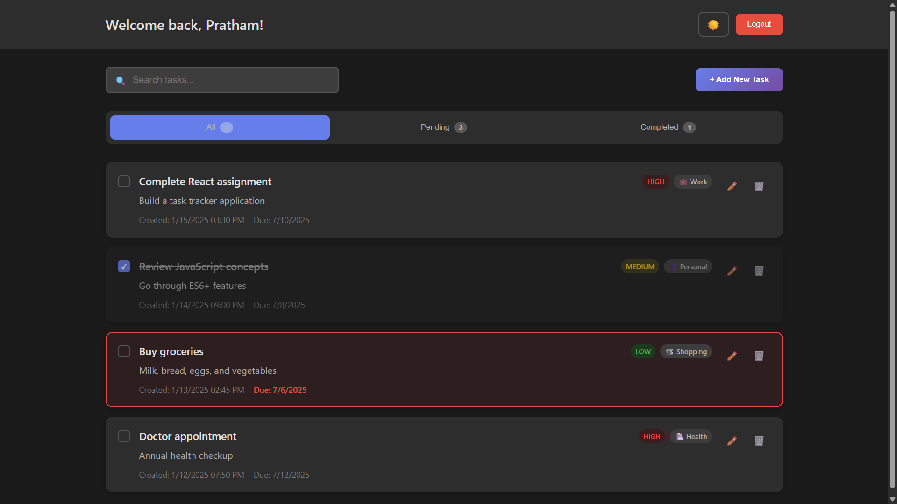
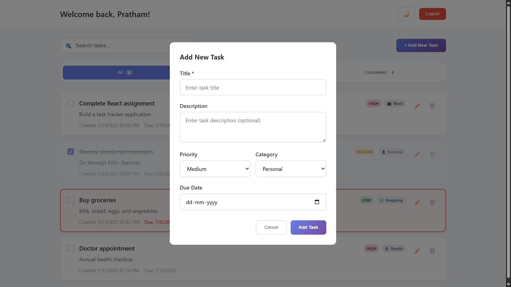

# 🔐 Secure Task Tracker

A modern task management system designed to help users organize, track, and manage their daily tasks efficiently.  
The project demonstrates **user authentication, role-based access, CRUD operations, logging, and interactive UI**, combining both frontend and backend concepts in a cohesive structure.
## 📖 Description

Personal Task Tracker is a comprehensive task management solution that allows users to create, edit, delete, and organize their tasks efficiently. With features like priority levels, categories, due dates, and a dark mode toggle, it provides everything you need to stay organized and productive.

## 🚀 Features

- **User Authentication (Backend Simulation)** – Secure login and registration flow with hashed passwords (simulated)  
- **JWT Authentication** – Token-based access for protected API endpoints (simulated)  
- **Role-Based Access Control** – Admin vs User permissions for task operations  
- **CRUD APIs for Tasks** – Create, read, update, delete tasks via simulated API endpoints  
- **Backend Logs** – All authentication and task operations logged in `logs/` folder  
- **Input Validation & Error Handling** – Simulated validation for user input and task operations  
- **Task Management** – Users can create, edit, delete, and mark tasks as complete  
- **Priority Levels** – Tasks categorized as Low, Medium, High  
- **Categories** – Work, Personal, Shopping, Health, Other  
- **Due Dates** – Deadlines with visual indicators for overdue tasks  
- **Search & Filter** – Simulated backend filtering of tasks  
- **Data Persistence** – Frontend uses `localStorage` to simulate database persistence  
- **Dark Mode** – Theme toggle for frontend UI  
- **Responsive Design** – Works seamlessly on desktop and mobile devices  
- **Visual Feedback** – Color-coded priorities and status indicators  


## 🛠️ Setup Instructions

1. **Clone the repository**

   ```bash
   git clone https://github.com/PraTham-Patill/task-tracker.git
   cd task-tracker
   ```

2. **Install dependencies**

   ```bash
   npm install
   ```

3. **Start the development server**

   ```bash
   npm start
   ```

4. **Open your browser**
   Navigate to [http://localhost:3000](http://localhost:3000)

## 🧰 Technologies Used

- **React.js** - Frontend framework for building user interfaces
- **Node.js / Express (Simulated)** – Backend API structure and routing  
- **JWT** – Authentication simulation for protected routes  
- **MySQL Database** for task and session persistence  
- **Logging** – Tracks authentication and task operations in `logs/` folder  
- **JavaScript (ES6+)** – Backend logic simulation  
- **API Design Concepts** – REST principles, status codes, error handling, validation  
- **Scalability Concepts** – Modular structure for microservices, caching, and deployment readiness  

## 📱 Usage

1. **Login** - Enter any username to access your personal dashboard
2. **Add Tasks** - Click "Add New Task" to create tasks with title, description, priority, category, and due date
3. **Manage Tasks** - Edit tasks inline, mark as complete, or delete with confirmation
4. **Filter Tasks** - Use filter tabs to view All, Pending, or Completed tasks
5. **Search** - Use the search bar to find specific tasks by title
6. **Dark Mode** - Toggle between light and dark themes using the theme button

## 🔗 Live Demo

🌐 **[View Live Demo](https://taskk-trackerr.vercel.app/)**

## 🖼️ Screenshots

### Dark Mode Dashboard



### Light Mode with Task Form



## 🎨 Features Showcase

* **Secure Authentication** – Simulated password hashing and JWT token issuance for protected endpoints  
* **Role-Based Access Control (RBAC)** – Admin vs User permissions for task operations  
* **CRUD API Operations** – Task creation, retrieval, update, and deletion with proper logging  
* **Backend Logging** – Authentication and task operations recorded in `logs/` folder for monitoring and auditing  
* **Input Validation & Error Handling** – Ensures API requests are validated and errors return meaningful messages  
* **API Design Principles** – RESTful API structure, proper status codes, modular endpoints, and versioning  
* **Scalability-Ready Architecture** – Modular design allows integration with real backend services, caching, and microservices in future  
* **Performance Simulation** – Efficient handling of tasks and simulated API responses  
* **Frontend Integration (Demo Only)** – Minimal React.js interface to demonstrate backend functionality  
* **Accessibility & Responsiveness** – Frontend UI ensures tasks and logs can be viewed on any device for testing purposes


## 🔧 Project Structure

```
src/
├── components/
│ ├── Login.js # User authentication component
│ ├── TaskDashboard.js # Main dashboard container
│ ├── TaskForm.js # Task creation/editing form
│ ├── TaskItem.js # Individual task display
│ ├── TaskList.js # Task list container
│ └── TaskFilter.js # Filter controls
├── logs/
│ ├── auth.log # Tracks registration/login events
│ └── tasks.log # Tracks task CRUD operations
├── utils/
│ ├── localStorage.js # MySQL database connection and utilities
│ └── sampleData.js # Sample tasks for demo
├── styles/
│ └── App.css # Main stylesheet
├── App.js # Root component
└── index.js # Application entry point
```

## 🌟 Key Highlights

* **Component-Based Architecture** - Well-organized, reusable React components
* **State Management** - Efficient use of React hooks (useState, useEffect)
* **Error Handling** - Proper validation and user feedback
* **Code Quality** - Clean, readable, and maintainable code
* **User Experience** - Intuitive design with helpful animations
* **Data Persistence** - Reliable localStorage implementation

## 🚀 Deployment

### Deploy to Vercel

1. **Install Vercel CLI**

   ```bash
   npm install -g vercel
   ```

2. **Build the project**

   ```bash
   npm run build
   ```

3. **Deploy**

   ```bash
   vercel
   ```

## 💡 Technical Implementation

* **React Hooks** (`useState`, `useEffect`) for state management  
* **CSS Grid & Flexbox** for responsive layouts  
* **CSS Custom Properties** for dark/light theme management  
* **MySQL Database** for task and session persistence
* **Event Handling & Form Validation** for interactive UI  
* **Simulated JWT & Role-Based Access** for protected functionality  
* **Logging** of user actions in `logs/` folder  
* **Modular Structure** for easy feature expansion

---
